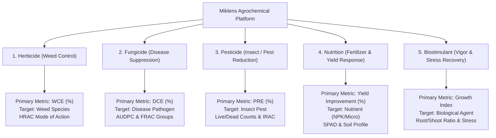

# Product Requirements Document (PRD)
## Miklens Agrochemical & Herbicide Trial Manager Platform
**Enterprise Agricultural Research & Formulation Efficacy Management System**

---

### Document Control
- **Document Version**: 2.5.0
- **Product Name**: Miklens Agrochemical Trial Manager
- **Product Category**: Enterprise Agronomic Research & Trial Data Management System (AgTech / ChemTech)
- **Deployment Platform**: Cross-Platform (Responsive Web SPA, PWA, Android Native via Capacitor)
- **Document Status**: Approved / Production Baseline

---

## 1. Executive Summary & Product Vision

### 1.1 Product Vision
To provide agricultural researchers, trial managers, formulation chemists, and field agronomists with a unified, offline-first digital trial management platform. The platform eliminates manual paper logging, standardizes scientific efficacy assessments across global agronomic standards (EPPO, GEP, FAO), accelerates R&D cycles through multimodal vision AI, and delivers instant, publication-ready scientific dossiers.

### 1.2 Core Value Proposition
- **Unified 5-in-1 Agronomic Engine**: Seamlessly manages trials across Herbicide, Fungicide, Pesticide, Nutrition, and Biostimulant categories under strict domain isolation.
- **True Offline Field Capability**: Fully operational in remote trial plots without cellular connectivity using IndexedDB local storage and automatic background synchronization.
- **Multimodal AI Field Scout**: Instant on-device photo analysis powered by Google Gemini to identify weed species, quantify weed cover %, evaluate foliar disease severity %, count pest populations, and diagnose nutrient deficiencies.
- **Scientific Statistical Rigor**: In-app execution of ANOVA (One-way, Two-way, Type III), post-hoc grouping (Tukey HSD, Duncan MRT, Dunnett), and dose-response regressions (ED50 probit) without requiring external SAS or R software.
- **Enterprise Reporting**: One-click generation of audit-ready PDF dossiers, Excel workbooks with embedded photos and formulas, executive PPTX presentations, Docx reports, and category-aware CSV exports.

---

## 2. Target Market & User Personas

### 2.1 Market Segments
1. **Agrochemical Formulation Manufacturers**: Evaluating proprietary chemical and biological active ingredient formulations against benchmark commercial standards.
2. **Contract Research Organizations (CROs)**: Conducting regulated Good Experimental Practice (GEP) field and greenhouse trials.
3. **University & Institutional Agronomy Labs**: Running randomized complete block designs (RCBD), dose-response curves, and resistance monitoring.
4. **Fertilizer & Biostimulant Innovators**: Measuring plant vigor, chlorophyll indices (SPAD), root-to-shoot biomass, and crop yield improvements.

### 2.2 User Personas

| Persona | Role | Key Objectives | Critical Pain Points Solved |
| :--- | :--- | :--- | :--- |
| **Dr. Rajesh (Chief Agronomist / Trial Director)** | R&D Director | Oversee trial protocols across multiple research stations; ensure regulatory compliance; review statistical efficacy summaries. | Inconsistent data collection across teams; tedious manual aggregation in Excel; delay in generating executive reports. |
| **Sandeep (Field Research Scout)** | Field Agronomist | Record daily/weekly plot observations, capture geo-tagged photos, log weather conditions, evaluate weed/pest/disease pressure. | Operating in remote fields with zero internet; manual estimation error; losing physical field logbooks. |
| **Dr. Sunita (Formulation Chemist)** | R&D Chemist | Develop new tank mixes, evaluate ingredient synergy, track loading %, calculate active ingredient cost per liter. | Disconnect between lab formulations and real-world field results; untracked recipe variations. |
| **Anita (Regulatory & Compliance Officer)** | Regulatory Affairs | Audit trial authenticity, verify timestamps and GPS coordinates, prepare dossiers for CIB&RC / EPA registration. | Missing chain of custody, unverified photographic evidence, unstandardized rating scales. |

---

## 3. Product Scope & The 5 Agronomic Disciplines

The platform enforces strict domain isolation so that each agricultural trial category functions with its dedicated terminology, rating scales, observation metrics, calculation algorithms, and reporting formats.



### Discipline Comparison Matrix

| Discipline | Target Entity | Primary Efficacy Metric | Key Category-Specific Inputs | Primary Observation Fields | Mode of Action Classification |
| :--- | :--- | :--- | :--- | :--- | :--- |
| **Herbicide** | Weed Species | Weed Control Efficiency (WCE %) | Weed Growth Stage, Site Type, Crop | Weed Cover %, Species Breakdown, Phytotoxicity %, Desiccation Status | HRAC / WSSA Group |
| **Fungicide** | Plant Pathogen / Disease | Disease Control Efficiency (DCE %) | Pathogen Name, Inoculation Method/Date, Severity Scale, FRAC Group | Disease Severity %, Disease Incidence %, Green Leaf Area %, AUDPC, Lesion Count | FRAC Group |
| **Pesticide** | Insect / Arthropod Pest | Pest Reduction Efficiency (PRE %) | Pest Life Stage, Pre-Application Density, PHI (Days), IRAC Group | Pest Count, Live vs Dead Count, Damage Rating (0-9), Feeding Damage %, Beneficial Insect Count | IRAC Group |
| **Nutrition** | Crop Nutrition / Fertilizer | Yield Improvement (%) | Nutrient Type, Fertilizer Form, Application Rate (kg/ha), Soil Profile (pH, Clay, Sand, OC) | Visual Vigor (0-10), Deficiency Severity, Leaf Color Score (LCC), SPAD Chlorophyll, Plant Height, Tiller Count | Nutrient Category (Macro, Micro, Organic) |
| **Biostimulant** | Biological / Growth Agent | Growth Enhancement Index | Biological Agent, Abiotic Stress Condition (Drought/Salinity), Application Method | Overall Vigor (0-10), Shoot Density, Wilting Index, Root Biomass, Shoot Biomass, Root Length, Nodule Count | Biostimulant Class (Seaweed, Humic, Microbial) |

---

## 4. Functional Requirements & Feature Specifications

### Epic 1: Trial Lifecycle & Experimental Design Management

#### 1.1 Trial Creation & Experimental Layouts
- **FR-1.1.1**: The system shall support creating standalone trials and multi-replicated project trials.
- **FR-1.1.2**: Supported experimental designs shall include:
  - **Individual Standard Check Trials**
  - **Randomized Complete Block Design (RCBD)**: Field plots with custom replications and randomized treatment allocations.
  - **Completely Randomized Design (CRD)**: Controlled greenhouse or growth chamber trials.
  - **Pot Trials (rcbd-pot)**: Automated tracking of Pot Row, Pot Column, Pot Label, and spatial grid layouts.
  - **Split-Plot / Strip-Plot Designs**: Main factor (e.g. Irrigation/Tillage) and sub-factor (Formulation/Dosage).
  - **Lattice Designs**: Sub-block allocations for large screening programs.
- **FR-1.1.3**: Automatic Pot Label Generation shall parse row/column coordinates or sequential pot numbers and format labels into standard nomenclature (e.g., `Plant 1 (Pot A)`).

#### 1.2 Trial Metadata & Agronomic Tracking
- **FR-1.2.1**: Universal trial records shall capture: Trial ID, Formulation Name, Treatment Dosage/Rate, Investigator, Date, Location, GPS Latitude/Longitude, Crop/Site Type, Variety, Application Timing (PRE, EPOST, POST, SEQ), Spray Weather (Temp, Humidity, Wind, Rain), and Plot Number.
- **FR-1.2.2**: Category-specific validation shall dynamically enforce relevant fields (e.g., Disease Target for Fungicide, Weed Growth Stage for Herbicide).
- **FR-1.2.3**: Soil Profile Module: Capability to record Soil pH, Clay %, Sand %, Organic Carbon %, Soil Texture, NPK values, CEC, and soil moisture.

#### 1.3 Observation Tracking & Timeline Logging
- **FR-1.3.1**: Support flexible observation schedules based on Days After Application (DAA): Baseline (0 DAA), 3, 7, 14, 21, 28, 45, 60 DAA, or arbitrary custom dates.
- **FR-1.3.2**: Each observation point shall record category-specific metrics, weather conditions at observation time, crop phytotoxicity rating, desiccation/infection status, and observer field notes.
- **FR-1.3.3**: Finalization Workflow: Scientists can mark trials as "Finalized" with a final control duration, preventing accidental modifications while preserving audit history.

---

### Epic 2: Formulations & Ingredient Costing System

#### 2.1 Formulation Management
- **FR-2.1.1**: Centralized formulation registry partitioned by category.
- **FR-2.1.2**: Detailed chemical profiling: Formulation Code, Commercial Name, Formulation Type (EC, SC, SL, WP, WG, OD, ME), Mode of Action (HRAC/FRAC/IRAC), Density (g/mL), pH specification, and target species spectrum.
- **FR-2.1.3**: Eligibility Gatekeeper: A formulation must possess at least 3 defined chemical ingredients (Active Ingredient, Solvent/Carrier, Emulsifier/Surfactant) to qualify for new field trial linkage, preventing premature or invalid recipes.

#### 2.2 Ingredient Database & Cost Optimization
- **FR-2.2.1**: Master ingredient database tracking CAS numbers, functional roles (Active, Surfactant, Solvent, Stabilizer, Antifoam), unit costs (per kg / per liter), and hazard classifications.
- **FR-2.2.2**: Automatic Batch Cost Calculator: Dynamically calculates raw material cost per liter, active ingredient cost per hectare at recommended application dosage, and profit margin simulations.

---

### Epic 3: Multimodal Vision AI & Field Scout

#### 3.1 On-Device & Cloud AI Vision Engine
- **FR-3.1.1**: The system shall integrate Google Gemini Vision models (`gemini-2.5-flash`, `gemini-3.5-flash-lite`, `gemini-3.8`) with automatic fallback chains.
- **FR-3.1.2**: Category-Adaptive AI Analysis:
  - **Herbicide**: Identifies weed species, estimates total weed cover percentage (0-100%), detects crop injury/phytotoxicity, and recommends control efficacy score.
  - **Fungicide**: Detects foliar fungal/bacterial pathogens, calculates disease severity percentage and incidence, measures green leaf area %, and counts leaf lesions.
  - **Pesticide**: Detects arthropod pests, estimates insect counts per plant, distinguishes live vs dead insects, assesses feeding damage percentage, and counts beneficial insects.
  - **Nutrition**: Analyzes leaf color against standard Leaf Color Chart (LCC), identifies specific nutrient deficiency symptoms (N, P, K, Fe, Zn), and estimates plant vigor score.
  - **Biostimulant**: Evaluates canopy density, Leaf Area Index (LAI), abiotic stress recovery (drought/heat wilting), and shoot vigor score.
- **FR-3.1.3**: In-app Image Cropper: Users can crop, rotate, and zoom into specific leaves or weed patches before feeding to AI, maximizing diagnostic accuracy.
- **FR-3.1.4**: Anti-Hallucination Guardrails: Prompts strictly constrain AI output to physically visible symptoms in the photo, flagging uncertainties.

#### 3.2 Voice Field Scout
- **FR-3.2.1**: Speech-to-text field recorder enabling agronomists to dictate notes hands-free in the field.
- **FR-3.2.2**: AI Parsing: Automatically extracts quantitative observation metrics (e.g. "Weed cover is 15 percent, slight yellowing on tips, temperature 28 degrees") into structured database fields.

---

### Epic 4: Weather Intelligence & Spray Decision Advisor

#### 4.1 Real-Time & Historical Weather Integration
- **FR-4.1.1**: Automatic geocoding and reverse geocoding from GPS coordinates.
- **FR-4.1.2**: Integration with Open-Meteo API for real-time application weather and historical weather interpolation for past observation dates.
- **FR-4.1.3**: Automatic soil data extraction (SoilGrids API) providing regional soil pH and texture based on GPS coordinates.

#### 4.2 Spray Advisor & Environmental Risk Engine
- **FR-4.2.1**: Spray Weather Risk Badge: Evaluates current conditions against agronomic safety thresholds:
  - **Wind Speed Risk**: Safe (3-15 km/h), Drift Hazard (>15 km/h), Inversion Hazard (<3 km/h).
  - **Delta-T Indicator**: Optimal droplet survival (2-8°C), High Evaporation (>8°C), Condensation (<2°C).
  - **Rainfastness Assessment**: Evaluates precipitation forecast within 2-6 hours post-application based on formulation rainfastness characteristics.

---

### Epic 5: Reporting, Analytics & Multi-Format Document Engine

#### 5.1 Category-Aware Data Exports
- **FR-5.1.1**: **CSV Trial Export**:
  - Dynamically builds export headers strictly matching the selected category.
  - Herbicide exports include Weed Species, Weed Growth Stage, Weed Control Efficiency %, Weed Cover %, Phytotoxicity %, and species breakdown.
  - Excludes unrelated columns from other categories (e.g. no pathogen names, pest counts, or uncollected soil parameters).
  - Primary metric output formatted as clean numerical percentages (e.g. `98%`), preventing serialization errors.
- **FR-5.1.2**: **Tidy Data Export (CSV)**: Long/tidy format (one row per Plot × DAA) formatted for R, Python (pandas), and SAS statistical packages.
- **FR-5.1.3**: **ARM Format Exporter**: Agriculture Research Manager standard interchange format.

#### 5.2 Enterprise Document Dossiers
- **FR-5.2.1**: **Scientific PDF Report (jsPDF)**: Full-color dossier containing executive summaries, treatments tables, ANOVA/LSD statistical comparisons, timeline charts, and high-resolution photo grids.
- **FR-5.2.2**: **Advanced Excel Dossier (ExcelJS)**: Multi-tab workbook containing cover page, trial metadata, raw observations, summary statistics, embedded photos, and live Excel formulas (`AVERAGE`, `STDEV`, `ANOVA`).
- **FR-5.2.3**: **Executive PowerPoint Presentation (pptxgenjs)**: Ready-to-present slide deck featuring project overview, treatment efficacy charts, Tukey grouping tables, and photographic evidence.
- **FR-5.2.4**: **Word Document (docx)**: Formal R&D scientific dossier for regulatory submissions.
- **FR-5.2.5**: **QR Code Plot Cards**: Generation of QR cards for physical plot stakes to enable instant scanning and field updates via mobile camera.

---

### Epic 6: Offline Subsystem & Dual-Tier Synchronization

#### 6.1 Offline-First Local Persistence
- **FR-6.1.1**: Complete local caching of all trials, projects, formulations, and photo blobs inside IndexedDB via Dexie.js.
- **FR-6.1.2**: All create, update, delete (CRUD) operations must succeed locally even when completely disconnected from the network.
- **FR-6.1.3**: Dedicated offline indicator displaying synchronization status and pending queue count.

#### 6.2 Dual Backend Architecture & Background Sync
- **FR-6.2.1**: **Primary Cloud Path**: Firebase Firestore and Firebase Authentication with offline caching.
- **FR-6.2.2**: **Legacy / Enterprise Mirror Path**: Google Apps Script (GAS) web app synchronizing data into Google Sheets and photos into Google Drive.
- **FR-6.2.3**: Chunked Upload Protocol: High-resolution photos are split into 1MB chunks for reliable transmission over low-bandwidth cellular networks with auto-retry and exponential backoff.

---

### Epic 7: Administration, Security & Role-Based Access Control

#### 7.1 User Roles & Permissions
- **Admin / Director**: Full read/write access to all categories, user management, audit log access, data purge capabilities.
- **Senior Scientist**: Read/write access within assigned categories; ability to finalize trials and export dossiers.
- **Field Scout / Junior Agronomist**: Create and edit observations and trials assigned to them; photo uploads; no deletion privileges.
- **Viewer / Auditor**: Read-only access to completed trials and reports; export permissions configurable per user.

#### 7.2 Multi-Tenant Organization Management
- **FR-7.2.1**: Support for multi-branch organizations (e.g. North Zone, South Zone, Research Station A).
- **FR-7.2.2**: Data filtering ensuring field teams only access trials relevant to their station while corporate admins view consolidated analytics.

---

## 5. Non-Functional Requirements (NFRs)

### 5.1 Performance & Scalability
- **NFR-1.1**: Initial dashboard load time < 1.5 seconds on a 4G mobile connection.
- **NFR-1.2**: Smooth rendering (60 FPS) when scrolling lists of 1,000+ trials using virtualized rendering.
- **NFR-1.3**: Statistical ANOVA calculation for 50 treatments × 4 replications across 5 timepoints completed in < 200ms using Web Workers.
- **NFR-1.4**: PDF dossier generation for 20-page scientific report completed in < 3 seconds on client device.

### 5.2 Offline Reliability & Data Integrity
- **NFR-2.1**: Zero data loss guarantee: Any offline observation logged must persist indefinitely in IndexedDB until confirmed synced.
- **NFR-2.2**: Conflict Resolution: Automatic last-write-wins with field-level timestamping and tombstone deletion tracking.
- **NFR-2.3**: Photo Compression: Client-side image compression (WebP / JPEG 85% quality, max 1920px) reducing 10MB camera captures to < 600KB before transmission.

### 5.3 Security & Compliance
- **NFR-3.1**: End-to-end HTTPS / TLS 1.3 encryption in transit.
- **NFR-3.2**: Firestore Security Rules enforcing category validation and user role authorization at database level.
- **NFR-3.3**: Secure local credential storage; sensitive API keys stored with optional client-side masking.
- **NFR-3.4**: Regulatory compliance with EPPO PP 1 series standards for efficacy evaluation of plant protection products.

---

## 6. UX Architecture & Navigation

The platform follows a responsive, high-contrast agricultural UX design with tactile buttons optimized for direct sunlight and field tablet use:

```
[ TopBar: Category Switcher (Herbicide | Fungicide | Pesticide | Nutrition | Biostimulant) ]
[ Navigation Bar ]
  ├── Dashboard (Category KPIs, Weather Risk, Recent Trials, Quick Actions)
  ├── All Categories (Consolidated cross-discipline overview)
  ├── Large Field Trials (Commercial demonstration plots & spatial maps)
  ├── Projects (Grouped RCBD/CRD experimental trials)
  ├── Plot Scanner (QR code camera scanner for immediate plot observation)
  ├── Formulations (Chemical registry, ingredient costing, MOA)
  ├── Trials (Primary trial list, filtering, bulk actions, category-aware export)
  ├── Reports & Cards (PDF, Excel, PPTX, Word dossiers, Print Cards)
  ├── Dose-Response & Resistance (ED50 probit, resistance risk curves)
  ├── Statistics & Analytics (ANOVA, Tukey HSD, Agronomic trends)
  └── Settings (Sync queue, Firebase config, API keys, User Management)
```

---

## 7. Release Roadmap & Milestones

| Milestone | Target Horizon | Core Deliverables | Success Criteria |
| :--- | :--- | :--- | :--- |
| **Phase 1: Foundation (Completed)** | Q1 | Herbicide Trial Manager core; Google Sheets + Drive sync; basic PDF export; Android APK. | 100% offline logging operational; 0 data loss in field tests. |
| **Phase 2: 5-Category Expansion (Completed)** | Q2 | Multi-category architecture (Fungicide, Pesticide, Nutrition, Biostimulant); Firebase Firestore migration; Gemini Vision AI integration. | Category isolation verified; automated weed/disease photo detection active. |
| **Phase 3: Advanced Analytics & Reporting (Current)** | Q3 | In-browser ANOVA & Tukey HSD; Advanced ExcelJS dossiers; PPTX generator; strictly category-aware CSV exporters. | Efficacy calculations 100% verified; zero cross-category column pollution in CSVs. |
| **Phase 4: Enterprise Scale & IoT (Upcoming)** | Q4 | Drone multispectral imagery import (NDVI calculation); automated sensor API integration; multi-language field UI (Hindi, Spanish, Portuguese). | Drone orthomosaic plot segmentation; sub-meter GPS boundary mapping. |

---

## 8. Verification & Sign-Off

| Stakeholder Role | Name / Title | Signature | Date |
| :--- | :--- | :--- | :--- |
| **Product Manager** | Lead AgTech Product Architect | `[APPROVED]` | 2026-09-27 |
| **Chief Agronomist** | R&D Trial Director | `[APPROVED]` | 2026-09-27 |
| **Principal Software Architect** | Platform Engineering Lead | `[APPROVED]` | 2026-09-27 |
