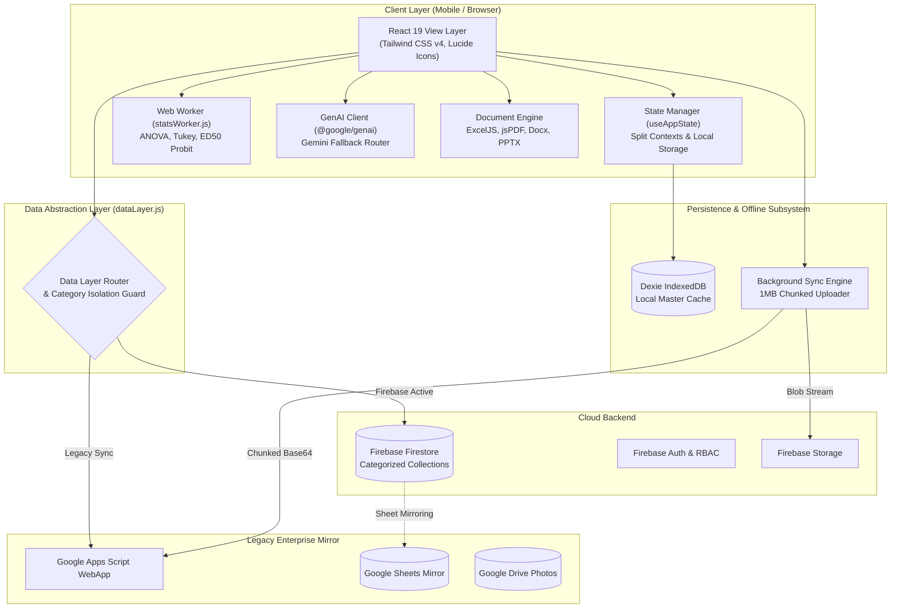
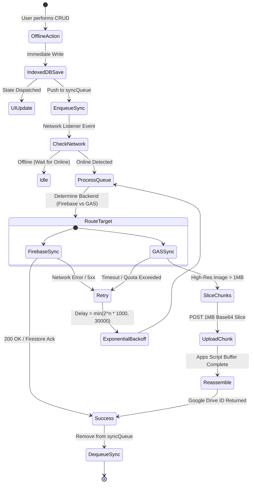
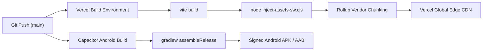

# Technical Design Specification (TDS)
## Miklens Agrochemical & Herbicide Trial Manager Platform
**Architecture, Systems Design, Schemas & Algorithmic Engineering Specification**

---

### Document Control
- **Document Version**: 2.5.0
- **Document Status**: Production Architecture Baseline
- **Primary Runtime**: Client-Side Single Page Application (React 19 + Vite 8)
- **Mobile Engine**: Capacitor v8 (Android Native)
- **Cloud Backend**: Google Firebase v12 (Firestore, Auth, Storage)
- **Legacy / Secondary Mirror**: Google Apps Script (GAS) + Google Sheets + Google Drive

---

## 1. System Topology & Architectural Principles

The Miklens Trial Manager is built on an **Offline-First, Client-Centric Architecture**. Because agricultural field researchers operate in remote geographic environments with unstable or non-existent cellular connectivity, all core capabilities (data ingestion, image capture, statistical analysis, and report generation) execute directly on the client device.



### Architectural Tenets
1. **Local-First Consistency**: All mutations are immediately committed to local IndexedDB and React state, ensuring 0ms latency for field scouts.
2. **Category Isolation**: Strict schema and collection partitioning across Herbicide, Fungicide, Pesticide, Nutrition, and Biostimulant domains.
3. **Decoupled Reporting**: Multi-format reporting (PDF, Excel, PPTX, Docx, CSV) operates client-side with zero external cloud rendering dependencies.
4. **Adaptive Multimodal AI**: Multi-model fallback chains mitigate API quota exhaustion and model deprecations transparently.

---

## 2. Technology Stack & Dependencies

```
┌─────────────────────────────────────────────────────────────────────────────┐
│                              FRONTEND RUNTIME                               │
│  React 19.2.6  │  React Router 7.15.1 (HashRouter)  │  Tailwind CSS 4.3.0   │
└─────────────────────────────────────────────────────────────────────────────┘
┌─────────────────────────────────────────────────────────────────────────────┐
│                           STORAGE & CLOUD ENGINE                            │
│  Dexie 4.4.4 (IndexedDB)  │  Firebase SDK 12.15.0  │  Google Apps Script    │
└─────────────────────────────────────────────────────────────────────────────┘
┌─────────────────────────────────────────────────────────────────────────────┐
│                           AI & SCIENTIFIC ENGINES                           │
│  @google/genai 2.6.0  │  jStat 1.9.6 (ANOVA/Stats) │  Chart.js 4.5.1        │
└─────────────────────────────────────────────────────────────────────────────┘
┌─────────────────────────────────────────────────────────────────────────────┐
│                         DOCUMENT GENERATION ENGINES                         │
│  exceljs 4.4.0 │ jsPDF 4.2.1 │ pptxgenjs 4.0.1 │ docx 9.7.1 │ qrcode 1.5.4 │
└─────────────────────────────────────────────────────────────────────────────┘
┌─────────────────────────────────────────────────────────────────────────────┐
│                         MOBILE RUNTIME (CAPACITOR)                          │
│  @capacitor/core 8.3.4  │  @capacitor/camera 8.2.0  │  @capacitor/filesystem│
└─────────────────────────────────────────────────────────────────────────────┘
```

---

## 3. Data Architecture & Entity Schemas

### 3.1 Trial Entity Schema (`Trial`)
Stored in Firestore collections: `herbicide_trials`, `fungicide_trials`, `pesticide_trials`, `nutrition_trials`, `biostimulant_trials`.

```typescript
interface Trial {
  ID: string;                         // Unique Unix timestamp / UUID string
  Category: 'herbicide' | 'fungicide' | 'pesticide' | 'nutrition' | 'biostimulant';
  TrialName: string;
  ProjectID?: string;                 // Linked multi-treatment project
  BlockID?: string;                   // Replication block (e.g. 'R1', 'R2')
  PlotNumber?: string;                // Plot identifier (e.g. '101', 'P1')
  FormulationID: string;
  FormulationName: string;
  InvestigatorName: string;
  TrialDesign: 'Standard' | 'RCBD' | 'CRD' | 'PotTrial' | 'Split-Plot' | 'Lattice';
  Date: string;                       // ISO datetime string
  Location: string;                   // Textual address / station name
  GPSLatitude?: string | number;
  GPSLongitude?: string | number;
  Dosage: string;                     // e.g. "10 ml/L", "500 g/ha"
  ApplicationTiming: 'PRE' | 'EPOST' | 'POST' | 'LPOST' | 'SEQ';
  
  // Agronomic Context
  Crop: string;
  Variety?: string;
  PreviousCrop?: string;
  IrrigationMethod?: string;
  PlantPopulation?: string;
  SiteType?: string;                  // For non-crop herbicide trials (e.g. 'Open field')
  
  // Soil Analysis Profile
  SoilPH?: string;
  SoilClay?: string;
  SoilSand?: string;
  SoilOC?: string;
  SoilTexture?: string;
  SoilDataJSON?: string;              // Extended SoilProfile JSON
  
  // Weather at Application
  Temperature?: string | number;
  Humidity?: string | number;
  Windspeed?: string | number;
  Rain?: string | number;
  WeatherDataJSON?: string;           // Full Open-Meteo hourly record
  
  // Pot Trial Specifics (if rcbd-pot)
  PotRow?: string | number;
  PotCol?: string | number;
  PotLabel?: string;
  PotLayout?: string;
  
  // Category-Specific Dynamic Fields
  WeedSpecies?: string;               // Herbicide
  WeedGrowthStage?: string;           // Herbicide
  DiseaseTarget?: string;             // Fungicide
  PathogenName?: string;              // Fungicide
  DiseaseSeverityScale?: string;      // Fungicide
  InoculationMethod?: string;         // Fungicide
  FRACGroup?: string;                 // Fungicide
  PestTarget?: string;                // Pesticide
  PestSpecies?: string;               // Pesticide
  PestDensityBefore?: number;         // Pesticide
  IRACGroup?: string;                 // Pesticide
  NutrientType?: string;              // Nutrition
  NutrientSource?: string;            // Nutrition
  FertilizerForm?: string;            // Nutrition
  BiostimulantType?: string;          // Biostimulant
  ActiveBiologicals?: string;         // Biostimulant
  StressType?: string;                // Biostimulant
  YieldValue?: string | number;       // Crop yield (kg/ha or t/ha)
  
  // Efficacy & Lifecycle
  Result: 'Excellent' | 'Good' | 'Fair' | 'Poor' | 'Control' | 'Pending';
  FinalEfficacy?: number;             // Explicit final percentage
  IsCompleted: boolean;               // Finalized status
  FinalizationDate?: string;
  FinalControlDuration?: string;
  IsControl: boolean;
  IsStandardCheck: boolean;
  
  // Observations & Photos (JSON stringified)
  EfficacyDataJSON: string;           // Observation[]
  PhotoURLs: string;                  // PhotoRecord[]
  AISummariesJSON?: string;           // MultiProvider AI analysis logs
  
  // Sync & Audit
  CreatedBy?: string;
  CreatedAt?: string;
  UpdatedAt?: string;
  _dirty?: boolean;
}
```

### 3.2 Observation JSON Schema (`EfficacyObservation`)
Serialized inside `trial.EfficacyDataJSON`:

```typescript
interface EfficacyObservation {
  id: string;
  daa: number;                        // Days After Application (e.g. 0, 7, 14, 28)
  date: string;                       // YYYY-MM-DD
  isBaseline?: boolean;
  
  // Herbicide Fields
  weedCover?: number;                 // 0 - 100 %
  weedDetails?: Array<{
    species: string;
    cover: number;
  }>;
  
  // Fungicide Fields
  diseaseSeverity?: number;           // 0 - 100 %
  diseaseIncidence?: number;          // 0 - 100 %
  greenLeafArea?: number;             // 0 - 100 %
  plantHealthScore?: number;          // 1 - 10
  lesionCountAvg?: number;
  chloroticHaloIncidence?: number;
  defoliationPct?: number;
  AUDPC?: number;
  
  // Pesticide Fields
  pestCount?: number;
  liveInsectCount?: number;
  deadInsectCount?: number;
  eggCount?: number;
  larvaCount?: number;
  adultCount?: number;
  damageRating?: number;              // 0 - 9 scale
  feedingDamagePct?: number;
  beneficialCount?: number;
  
  // Nutrition & Biostimulant Fields
  visualVigor?: number;               // 0 - 10 scale
  overallVigor?: number;              // 0 - 10 scale
  deficiencySign?: string;            // 'N' | 'P' | 'K' | 'Fe' | 'Zn' etc.
  deficiencySeverity?: number;        // 0 - 10
  leafColorScore?: number;            // 1 - 5 (LCC)
  chlorophyllIndex?: number;          // SPAD reading
  plantHeight?: number;               // cm
  tillerCount?: number;               // per hill
  rootBiomass?: number;               // grams
  shootBiomass?: number;              // grams
  rootLength?: number;                // cm
  leafCount?: number;
  noduleCount?: number;
  abioticStressRecovery?: number;     // 1 - 10
  
  // Universal Phytotoxicity & Weather
  phytotoxicityPct?: number;          // 0 - 100 %
  phytotoxicityNotes?: string;
  weatherTempAtObs?: number;          // °C
  weatherHumidityAtObs?: number;      // %
  weatherWindAtObs?: number;          // km/h
  weatherRain?: number;               // mm
  notes?: string;
}
```

---

## 4. Category Domain Isolation & Dynamic Field Mapping

The system utilizes a central configuration engine [`src/utils/categoryConfig.js`](file:///c:/Users/Dell/Desktop/Apps/Miklens-herbicide-trial-manager-7-main/Miklens-herbicide-trial-manager-7-main/src/utils/categoryConfig.js) that establishes the single source of truth for all category behaviors.

```
                      ┌───────────────────────────┐
                      │    categoryConfig.js      │
                      │  (Master Central Registry)│
                      └─────────────┬─────────────┘
                                    │
         ┌──────────────┬───────────┼───────────┬──────────────┐
         ▼              ▼           ▼           ▼              ▼
    [Herbicide]    [Fungicide] [Pesticide] [Nutrition]   [Biostimulant]
    - WCE (%)      - DCE (%)   - PRE (%)   - Yield (%)   - Growth Index
    - WeedCover    - Severity  - PestCount - Vigor (0-10)- Biomass
    - HRAC Group   - FRAC Group- IRAC Group- Soil NPK    - Stress Index
```

### Partitioned Database Collections
To guarantee zero cross-contamination, Firestore collections and IndexedDB object stores are dynamically queried by category prefix:
- Trials: `<category>_trials`
- Projects: `<category>_projects`
- Formulations: `<category>_formulations`
- Ingredients: `<category>_ingredients`
- Replications / Blocks: `<category>_blocks`

### Category Validation Guardrails
A dedicated middleware [`src/services/dataLayer.js`](file:///c:/Users/Dell/Desktop/Apps/Miklens-herbicide-trial-manager-7-main/Miklens-herbicide-trial-manager-7-main/src/services/dataLayer.js) (`validateCategoryDataOperation`) validates every CRUD operation before execution:
1. Rejects any trial save where `trial.Category !== activeCategory`.
2. Blocks cross-category project linking (e.g. linking a Fungicide project to an Herbicide trial).
3. Strips irrelevant fields before database transmission.

---

## 5. Offline Storage & Dual-Tier Synchronization Protocol

### 5.1 Local Persistence Engine (Dexie.js / IndexedDB)
Dexie manages the client database schema:
```javascript
db.version(1).stores({
  trials: 'ID, Category, ProjectID, Date, IsCompleted, _dirty',
  projects: 'ID, Category, Name, _dirty',
  formulations: 'ID, Category, Name, _dirty',
  ingredients: 'ID, Category, Name, _dirty',
  syncQueue: '++id, entity, operation, retryCount, timestamp',
  photos: 'id, trialId, dataBlob, status'
});
```

### 5.2 Synchronization State Machine


---

## 6. Multimodal Vision AI Subsystem

### 6.1 Multi-Provider Engine Architecture
Implemented in [`src/services/multiProviderAI.js`](file:///c:/Users/Dell/Desktop/Apps/Miklens-herbicide-trial-manager-7-main/Miklens-herbicide-trial-manager-7-main/src/services/multiProviderAI.js) utilizing the Google GenAI SDK (`@google/genai`):

```javascript
// Model Hierarchy with Auto-Failover
const GEMINI_MODELS = [
  'gemini-2.5-flash',       // Primary: Optimal speed & multimodal accuracy
  'gemini-3.5-flash-lite',  // Fast Secondary: Lightweight, low latency
  'gemini-3.8'              // Tertiary: Advanced reasoning fallback
];
```

### 6.2 Failover & Recovery Logic
When an API request fails due to `RESOURCE_EXHAUSTED` (HTTP 429), `SERVICE_UNAVAILABLE` (HTTP 503 high demand), or model deprecation:
1. The error interceptor captures the status code and error message.
2. Identifies the next candidate model from `GEMINI_MODELS`.
3. Re-encodes the image buffer into an inline `image/jpeg` Part.
4. Executes immediate retry with exponential backoff (initial delay: 750ms).
5. Updates global AI block state to avoid repeated calls to currently overloaded models.

### 6.3 Prompt Engineering & JSON Output Specifications
Each category dispatches a specialized scientific system prompt requiring pure JSON responses:
```json
{
  "category": "herbicide",
  "primaryMetric": "Weed Control Efficiency",
  "estimatedValue": 92.5,
  "confidenceScore": 0.94,
  "detectedSpecies": [
    { "commonName": "Bermuda Grass", "scientificName": "Cynodon dactylon", "coverPct": 3.5 },
    { "commonName": "Parthenium Weed", "scientificName": "Parthenium hysterophorus", "coverPct": 1.0 }
  ],
  "phytotoxicityDetected": false,
  "phytotoxicityPct": 0,
  "diagnosticNotes": "Near complete foliar desiccation across broadleaf and grass targets. Negligible green leaf tissue remaining."
}
```

---

## 7. Agronomic Calculation & Statistical Computing Engine

### 7.1 Primary Efficacy Formulations
Handled in [`src/utils/categoryConfig.js`](file:///c:/Users/Dell/Desktop/Apps/Miklens-herbicide-trial-manager-7-main/Miklens-herbicide-trial-manager-7-main/src/utils/categoryConfig.js) (`calculateEfficacy`):

$$\text{WCE (Herbicide)} = \left( 1 - \frac{\text{Treated Weed Cover}}{\text{Control Weed Cover}} \right) \times 100$$

$$\text{DCE (Fungicide)} = \left( 1 - \frac{\text{Treated Disease Severity}}{\text{Control Disease Severity}} \right) \times 100$$

$$\text{PRE (Pesticide)} = \left( 1 - \frac{\text{Post-Treatment Count}}{\text{Pre-Treatment Count}} \right) \times 100$$

$$\text{Yield Improvement (Nutrition)} = \left( \frac{\text{Treated Yield}}{\text{Control Yield}} - 1 \right) \times 100$$

$$\text{AUDPC (Area Under Disease Progress Curve)} = \sum_{i=1}^{n-1} \frac{y_i + y_{i+1}}{2} \times (t_{i+1} - t_i)$$

### 7.2 Statistical ANOVA & Post-Hoc Engine
Implemented in [`src/utils/statsUtils.js`](file:///c:/Users/Dell/Desktop/Apps/Miklens-herbicide-trial-manager-7-main/Miklens-herbicide-trial-manager-7-main/src/utils/statsUtils.js) using `jStat`:
- **One-Way ANOVA**: Partitions variance into Between-Treatments ($SS_{tr}$) and Error ($SS_e$). Computes $F = \frac{MS_{tr}}{MS_e}$ and $p$-value.
- **Tukey's Honestly Significant Difference (HSD)**:
  $$HSD = q_{\alpha, k, df_e} \times \sqrt{\frac{MS_e}{n}}$$
  Assigns statistical significance grouping letters (`a`, `ab`, `b`, `c`) to treatments.
- **Web Worker Offloading**: For multi-replicated project datasets (e.g., 60 sub-trials across 6 observation dates), computation is delegated to `src/workers/statsWorker.js`, keeping the main UI thread at 60 FPS.

---

## 8. Document Generation Pipeline & Category-Aware Exporters

### 8.1 Category-Aware CSV Export Architecture
Implemented in [`src/services/trialReports.js`](file:///c:/Users/Dell/Desktop/Apps/Miklens-herbicide-trial-manager-7-main/Miklens-herbicide-trial-manager-7-main/src/services/trialReports.js) (`exportMultipleTrialsToCSV`):

```
Trials Selection Input
         │
         ▼
[ Category Validator & Partition Engine ]
         │
         ├── Multiple Categories Detected? ──► Recursively split into 1 CSV per Category
         │
         ▼
[ Extract Main Category Config (catConfig) ]
         │
         ├── 1. Universal Core Headers: Trial ID, Category, Formulation, Investigator, Date, Location, GPS, Dosage, Crop/Site, Timing, Design, Rep, Plot, App Weather
         │
         ├── 2. Selective Metadata Columns:
         │      - Variety: Included if not herbicide or if any trial contains variety data
         │      - Soil Profile (pH, Clay, Sand, OC, Texture): Included ONLY if nutrition or if user soil data exists
         │      - Previous Crop / Irrigation / Plant Population: Included ONLY if trials have non-empty data
         │
         ├── 3. Category Target Header: Weed Species | Target Disease | Target Pest | Nutrient Target | Biostimulant Type
         │
         ├── 4. Category-Specific Fields: (from catConfig.specificFields)
         │      e.g. Weed Growth Stage (Herbicide) | FRAC Group, Inoculation (Fungicide) | IRAC Group, PHI (Pesticide)
         │
         ├── 5. Efficacy Metric: Formatted using getTrialCalculatedEfficacy (e.g. "98%"), Overall Result, Finalized Status
         │
         ├── 6. Observation DAA Timeline: DAA, Obs Date
         │
         ├── 7. Category Observation Fields: (from catConfig.observationFields)
         │      e.g. Weed Cover % (Herbicide) | Disease Severity %, AUDPC (Fungicide) | Pest Count (Pesticide)
         │
         ├── 8. Herbicide Species Detail: Breakdown string ("Bermuda Grass: 45% | Parthenium: 13.5%")
         │
         └── 9. Observation Weather & Notes: Obs Status, Temp, Humidity, Wind, Rain, Obs Notes
         │
         ▼
Download Output: <CATEGORY>_Trials_Export_<YYYY-MM-DD>.csv (UTF-8 BOM Encoded)
```

### 8.2 Excel Multi-Tab Dossier Generation (`ExcelJS`)
Generates formal corporate workbooks with exact cell formatting:
1. **Sheet 1: Executive Summary**: Project details, metadata block, KPI metrics.
2. **Sheet 2: Observations Master (Tidy)**: Unpivoted dataset with live Excel formulas for means and standard deviations.
3. **Sheet 3: ANOVA & Tukey Grouping**: Statistical summary tables with color-coded significance groups.
4. **Sheet 4: Photographic Annexure**: High-resolution trial plot images dynamically scaled and anchored into worksheet cells.

---

## 9. Security, Authentication & Role-Based Access Control

### 9.1 Authentication & Multi-Tenancy
- **Provider**: Firebase Authentication supporting Email/Password and Persistent Local State.
- **Custom Claims**: User role injected into JWT token: `role: 'admin' | 'scientist' | 'scout' | 'viewer'`.
- **Tenancy Boundary**: `OrganizationID` attached to user profiles and trial records for cross-tenant isolation.

### 9.2 Firestore Security Rules (`firestore.rules`)
```javascript
rules_version = '2';
service cloud.firestore {
  match /databases/{database}/documents {
    // Helper functions
    function isAuthenticated() { return request.auth != null; }
    function isAdmin() { return request.auth.token.role == 'admin'; }
    function isScientist() { return request.auth.token.role in ['admin', 'scientist']; }
    
    // Category collections rule template
    match /{category}_{entity}/{docId} {
      allow read: if isAuthenticated();
      allow create: if isScientist() && request.resource.data.Category == category;
      allow update: if isScientist() && resource.data.Category == category;
      allow delete: if isAdmin();
    }
  }
}
```

---

## 10. Mobile Runtime (Capacitor) & PWA Engine

### 10.1 Native Android Shell (`capacitor.config.json`)
```json
{
  "appId": "com.miklens.trialmanager",
  "appName": "Miklens Trial Manager",
  "webDir": "dist",
  "bundledWebRuntime": false,
  "plugins": {
    "Camera": {
      "presentationStyle": "fullscreen"
    }
  }
}
```

### 10.2 Service Worker & PWA Caching Strategy
Defined in [`inject-assets-sw.cjs`](file:///c:/Users/Dell/Desktop/Apps/Miklens-herbicide-trial-manager-7-main/Miklens-herbicide-trial-manager-7-main/inject-assets-sw.cjs) and custom service worker:
- **Cache-First (Static Assets)**: Scripts, stylesheets, fonts, and icons cached indefinitely on initial install.
- **Network-First with Offline Fallback (API / Data)**: Firestore online fetch with fallback to IndexedDB.
- **Stale-While-Revalidate (Weather / Maps)**: Map tiles (OpenStreetMap) cached locally for offline spatial plot display.

---

## 11. CI/CD, Build & Deployment Pipeline



### Rollup Code Splitting Strategy
To maintain initial bundle sizes < 350KB:
- `vendor-react`: `react`, `react-dom`, `react-router-dom`
- `vendor-charts`: `chart.js`, `react-chartjs-2`, `leaflet`
- `vendor-docs`: `exceljs`, `jspdf`, `pptxgenjs`, `docx`
- `vendor-ai`: `@google/genai`
- `vendor-firebase`: `firebase/app`, `firebase/firestore`, `firebase/auth`

---

## 12. Verification & Architecture Sign-Off

| Reviewer Role | Name / Title | Status | Date |
| :--- | :--- | :--- | :--- |
| **Principal Software Architect** | Platform Systems Architect | `[APPROVED]` | 2026-09-27 |
| **Lead Frontend Engineer** | Senior React Engineer | `[APPROVED]` | 2026-09-27 |
| **Lead Data Engineer** | Cloud & Analytics Architect | `[APPROVED]` | 2026-09-27 |
